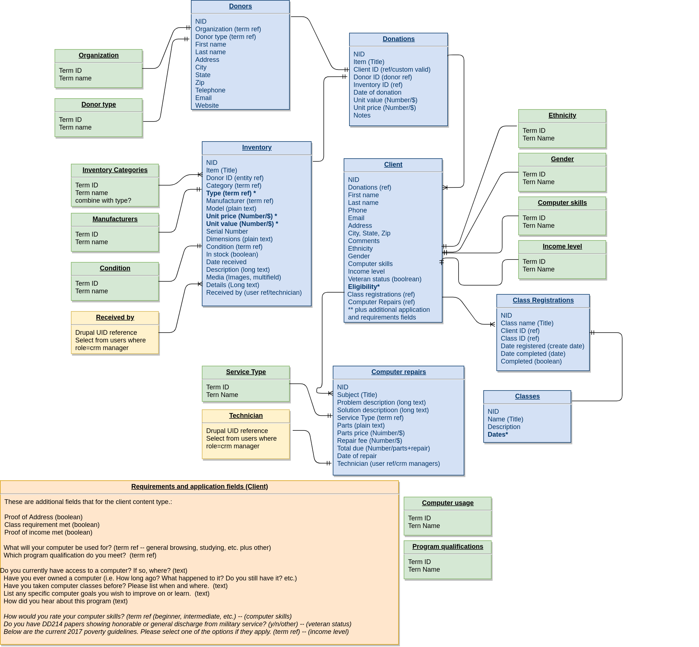

This page demonstrates the Drupal content architecture and data model that will be used to drive the CRM. There may be small changes to this model as development progresses but we will generally follow this structure.

* Blue = Content type
* Green = Vocabulary (categories)
* Yellow = User reference to internal admin user
* Pink = Additional client fields
Note: We will need a final list of "terms" for each of the 12 identified vocabularies (green).
----------

----------

## Dev notes

* Errata: in the above diagram there should be a one-to-one mapping from Donors to Inventory.
* These are not final field names; use sensible field names in all cases. 
* Some fields may need further adjusting as needed. 
* Fields in bold may require extra discussion.
* Does it make sense to combine "categories" and "type" into a single hierarchical vocabulary? 
