These wireframes represent each key area of the CRM along with general notes and developer notes for each section of the CRM. They are designed to show the key functionality and overall Drupal interface for the CRM, but are not an exact duplicate of the final user interface once it is developed in Drupal. We can adjust search filters, view fields, and other user interface elements as needed. 

* The number of items that appear in each page list is easily adjustable
* We will add "sort" links to all relevant view columns (e.g sort by "is in stock" or "unit value")
* All search filters are suggestions at this point, and adjustable based on usefulness

## Dashboard

This is the entry point into the CRM and consists of:

* Navigation to all available tools
* A variety of dashboard panes to show the most recent activity
* Feedback needed on the most useful panes to prioritize
* The most dynamic content is available in the main navigation
* Less frequently used tools (Donors, Classes, Reports) are in a separate, smaller navigation bar

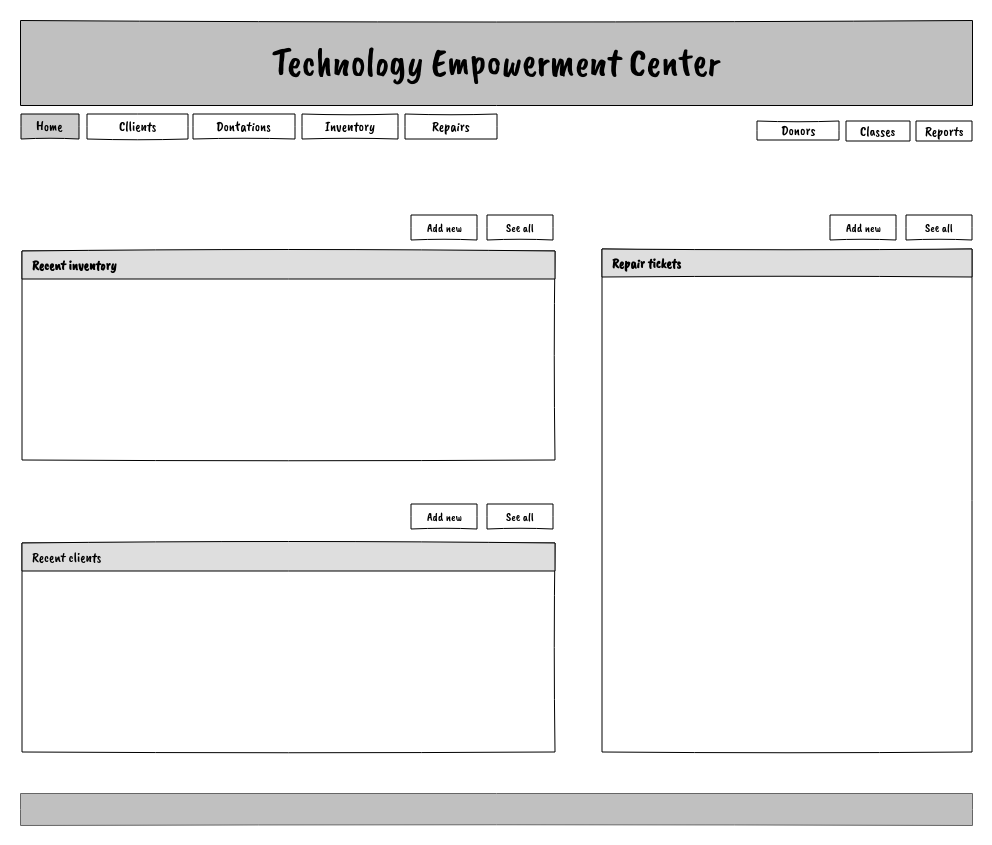

## Dev notes
*  Which panes are most used or should be featured here?  
*   The dashboard starts a navigation pattern to follow throughout:
    *   If a user clicks "Add new", let them add the node, but then return them to THIS page after save using destination query string
    *   If a user "edits" a node from a dashboard pane, return them to this screen after save
    *   Link node titles directly to the edit screen where it makes sense (e.g. jump directly to client edit screen or a repair ticket screen)
    *   HOWEVER -- we are not using node views -- therefore all links need to go directlly to the EDIT screen of the node in question
    *   When a user hits "save" they should be directed back to dashboard (using destitation querystring)
* This pattern should be repeated on all crm admin pages (e.g. save a client, return to client page)

## Clients

This is the main page for managing clients. From here you can add new clients, or edit existing clients. Clients are searchable by keyword, and a variety of filters for reporting purposes.

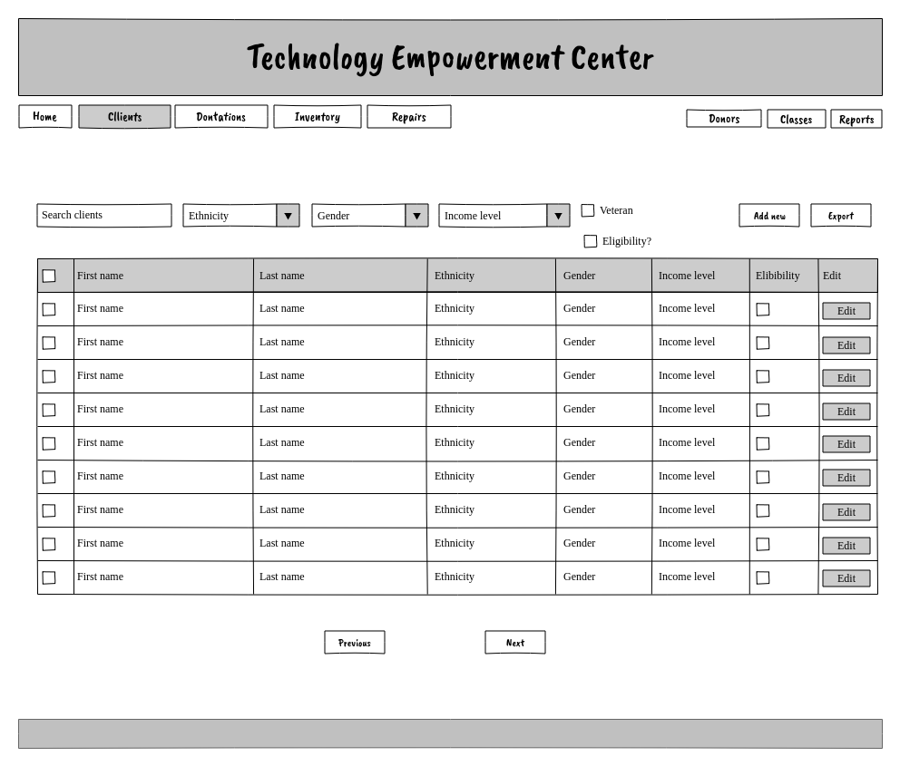

* Simple list of all clients
* Sort by "most recently added" (?)
* Should we add "date created" field to view?
* What are the most important fields for the initial view+filters?
* They would like a public facing form (or Webform) to prepopulate this data from client applicants
*   Add views export to all client to export client data
*   No "node view"
*   After an "edit > save" operation, the user should be redirected back to this screen using destination querystring
See: https://docs.google.com/forms/d/e/1FAIpQLScseMxGEn3VCgMom1EU775OCNxsDM9oghJGZvns7SaPdFzgtA/viewform
----------
## Clients - Basic info

The edit screen for clients uses a tabbed interface for simplicity. This first screen contains all of basic client info (name, address, etc)
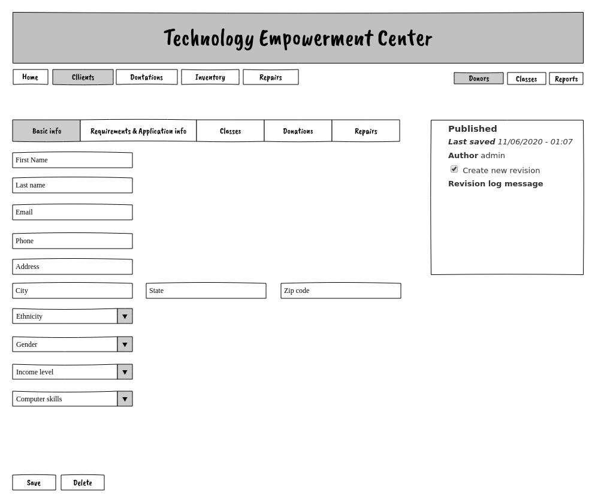

## Dev notes
*   Use Field Group to group user fields into tabs
*   This tab shows name and basic client info
*   Make all forms as minimal as possible, disable/hide fields when able
----------

## Clients - Requirements

This screen is used to track the necessary requirements for each client to receive a donation. It is manually managed by OBCED staff. Three of the flags are only used for tracking purposes and only the "eligibility" flag is used to determine whether a client is eligible for a donation. 

This screen also contains the various general questions that a client is asked during the application process.

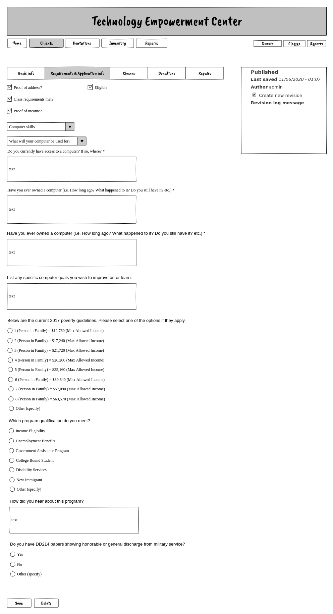

## Dev notes

*   This page contains a variety of application questions plus requirements fields
*   OBCED manually verifies these and checks them off when valid
*   Ultimately, a client is "eligible" or not "eligible" 
*   A client should not show up as eligible for a donation until checked
----------

## Clients - Classes
This screen is used to assign and review classes that have been assigned to a client. The main purpose of this tool is so that OBCED can track which classes a client has taken, as part of the overall eligibility requirements. 
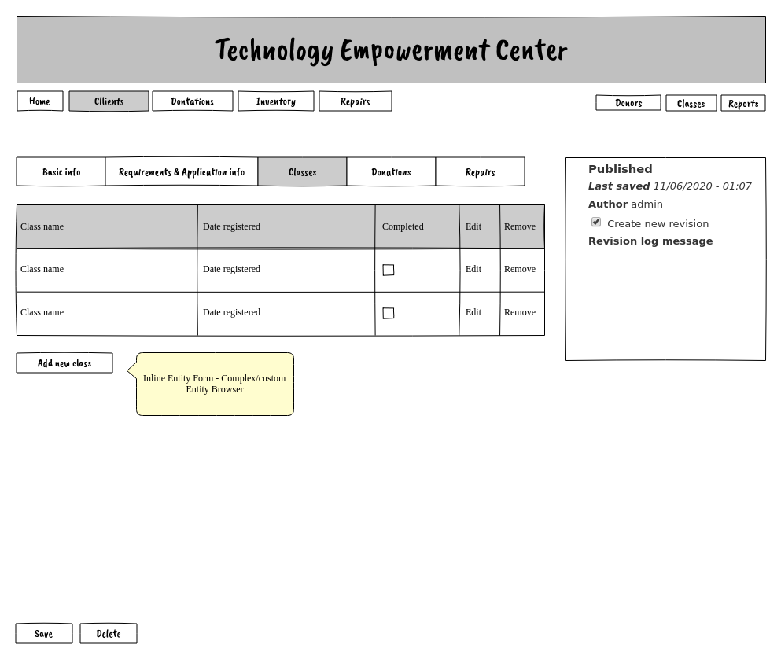

## Dev notes

*   Entity ref to Class Registrations
*   This uses custom IEF to create a new class reg node with a "class" reference (via browse "class registration" nodes
*   Class registration nodes include ref to "Class" plus date and completed status
*   This is used to verify a client has taken the required classes to be eligible for a donation

----------

## Clients - Donations

These screen allows you to grant a donation to client, and to track which items have been given to a given client. When a donation is granted, a new donation record is created and the item as marked as "out of stock" or 0 inventory in the database.

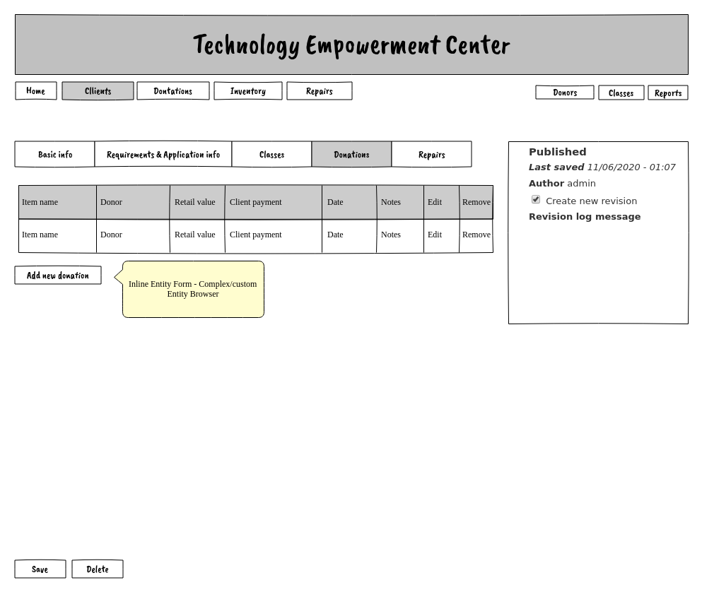

## Dev notes

*   Entity ref to Donation nodes
*   This uses IEF/custom Entity Browser to create new "donations" nodes
*   Use IEF and browser to search and filter an item from "inventory" plus additional fields as documents
*   Donations can also be created directly via the "Donations" screen 
*   In those cases, use a post save hook (or whatever) to create a corresponding reference here
----------

## Clients - Repairs

This screen allows you to create a new repair ticket and assign it to a client.

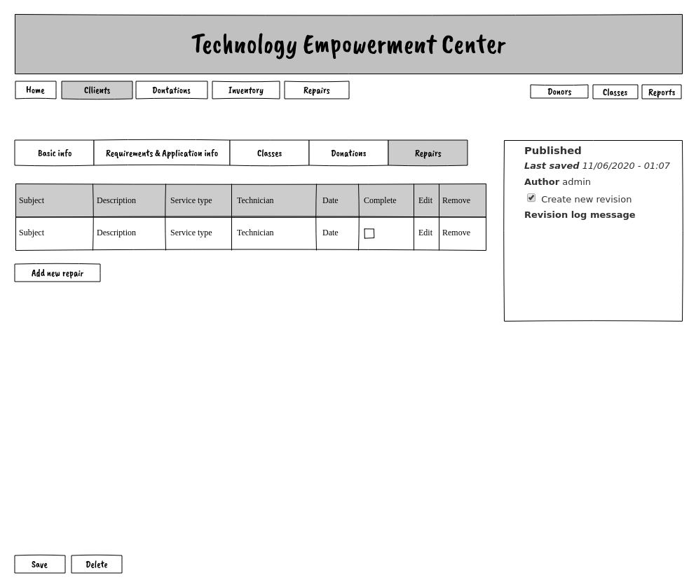

## Dev notes

*   Entity ref to Repair nodes
*   This uses IEF/custom Entity Browser to create new "repair" nodes
*   Repairs can also be created directly via the "Reparis" screen 
*   In those cases, use a post save hook (or whatever) to create a corresponding reference here

----------

## Donations

This screen provides an overview of all "donations" given from your "inventory" to a client. You can add a new donation directly from here, or from a client edit screen.

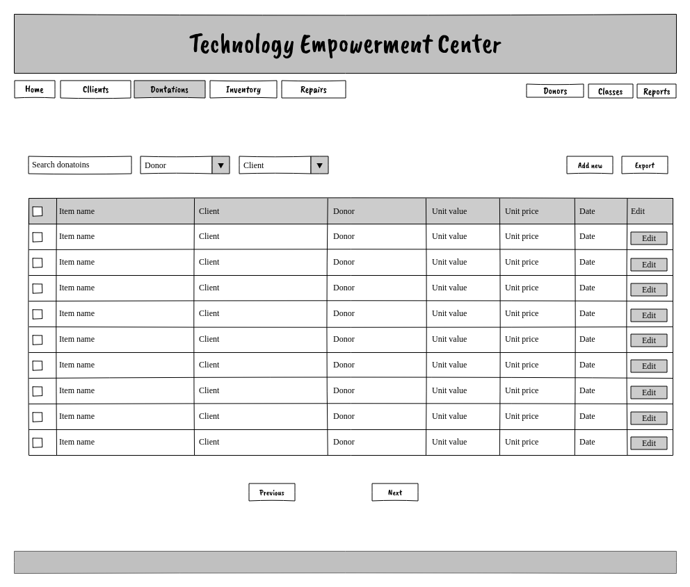

## Dev notes

*   A "donation" is the act of donating a piece of "inventory" to an eligible "client"
*   A client can have multiple "donations" (e.g computer + monitor)
*   Create a donation from this screen OR from the client screen/entity ref field
*   If created from this screen, create a new entry for the client field programatically
*   After add new/edit action, return to this screen via destination querystring
*   Views data export to export all data to Excel

## Inventory

This screen allows you to search and filter all available inventory, in addition to adding new items to inventory when they are donated by a donor. All donor gifts to OBCED are immediately tracked as "inventory" with a record mapping back to the donor. The "inventory" is meant as a historical record of all gifts/donations to OBCED from its donors. Items that are subsequently donated to a "client" will remain in "inventory" for reporting  and record-keeping purposes.

## Dev notes

*   Listing of ALL inventory
*   Sort by most recent+in stock
*   Once an item is donated, it is immediately "out of stock"
*   If a "donation" is made to a client, we need to set this boolean to 0 using a node save hook
*   Inventory nodes remain in place forever for historical and reporting purposes
*   Inventory is effectively the same thing as "donor gift" to OBCED
*   All inventory is tracked as an "inventory donation" from a specific donor
*   All "client donations" are taken directly out of this inventory and tracked in a separate "donations" content type
*   Add views data export
*   Are these the most important fields for views display? 
*   Are these appropriate filters? less?
*   No node view -- return to this screen after "edit > save"
----------

## Repairs

This is an overview of all repair tickets. You can assign and resolve repair tickets from this screen, or directly from the client screen.

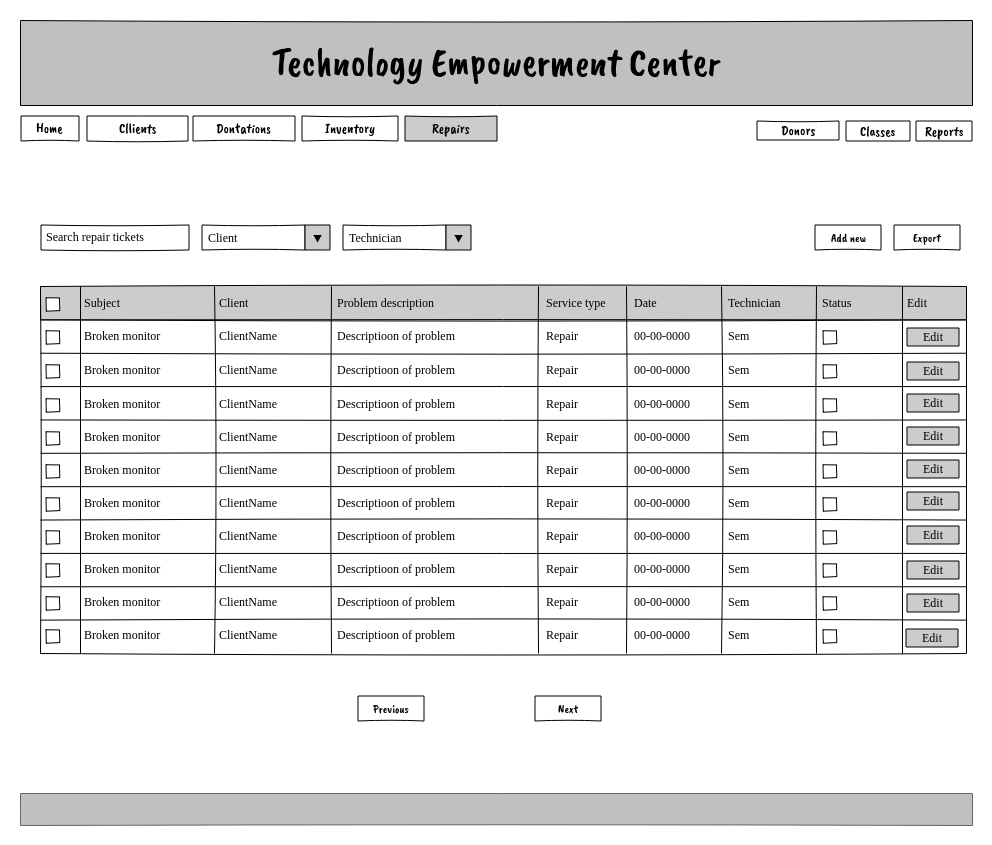

## Dev notes

*   This is a content type to track equipment repairs
*   Repairs can be added directly on this page OR from the client edit screen
*   If a node is added from this screen, add a reference to the client node
*   Add views export
*   Sort by most recent+status
*   No node view -- return to this screen after edit/save
*   Should "Status" be a term ref (e.g. open, closed, pending) or a boolean?

----------

## Donors

This screen allows you to add and manage donors. You must add a new donor before you can make a donation to inventory. One "organization" (e.g. UMN) can have multiple individual donors.

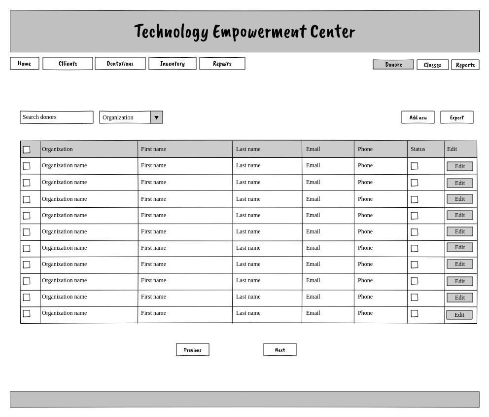

## Dev notes
*   Simple list of all donors
*   No node view, edit>save returns to this screen
*   Status=>true = an "active donor" -- is this necessary or can we just use publish/unpublished?
*   You need to add a "donor" before you can add any "inventory" in their name
*   Views data export
----------

## Classes

This screen allows you manage the classes that will be assigned to each client via a class registration node. OBCED maintains this list of eligible classes manually.

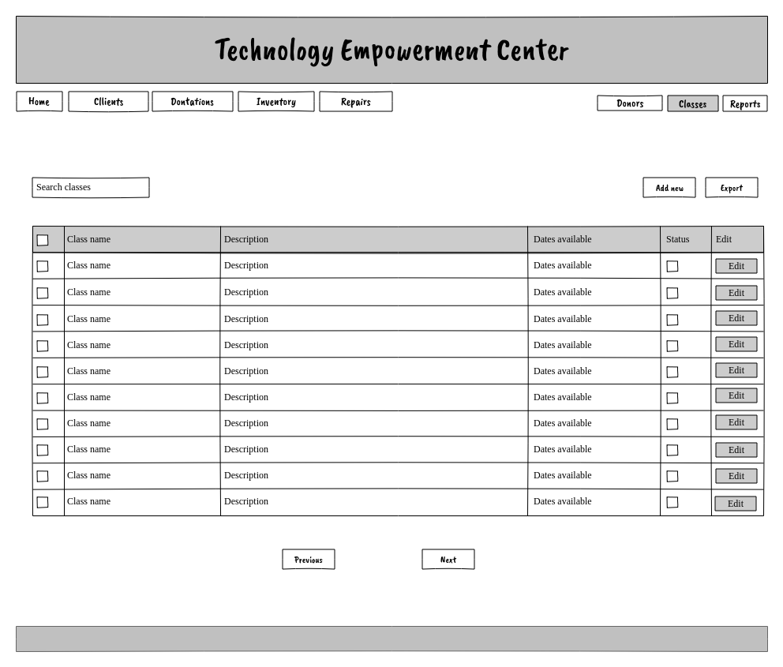

## Dev notes

*   Very simple listing of classes
*   Classes are added via "Class registration" nodes (via entity ref field on client node)
*   Actual classes are maintained in UMN system -- these are managed manually
*   What purpose does the date field serve? Can we remove and have a class either be active or inactive?
*   Should we add a UMN class # field or any other data?
*   After edit>save return to this screen
*   views data export
----------

## Reports

TBD: how to handle reports? What is critical and what can be phase two? The screenshot lists some of the requested reports but we believe most of these can be handled by the existing views/exports arleady outlined. 

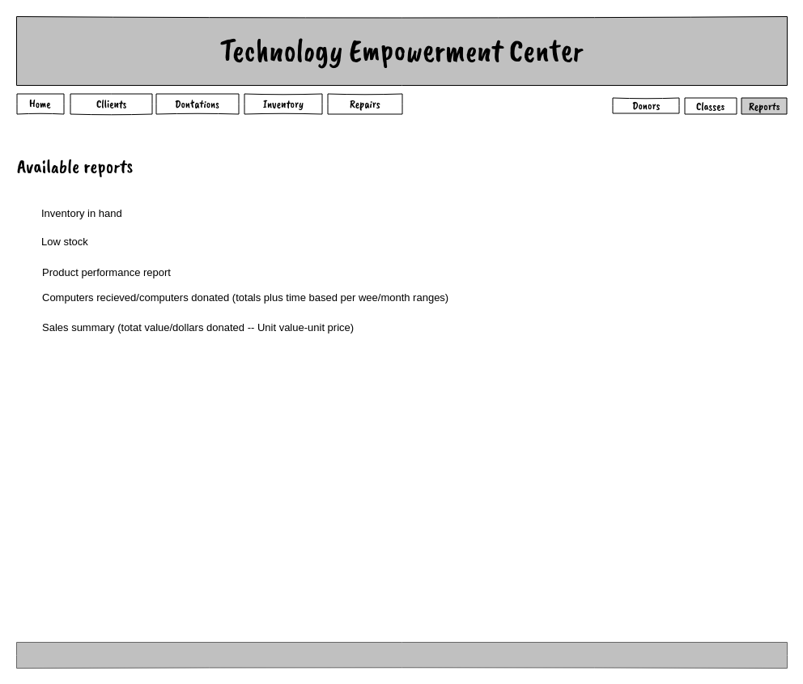

## Dev notes

*   Many of these are built-in using the existing screens
*   e.g. you can sort and filter inventory by "category" and stock to check low stock
*   In all cases, we provide CSV exports so that you can analyze and report on data in Excel
*   Creating "custom" reports (e.g. a custom "sales" report with totals is possible, but requires a lot of custom programming 
*   Can we rely on Excel and existing views for most or all reports given our budget constraints?
*   More custom or built in reports can be added in future phases.
